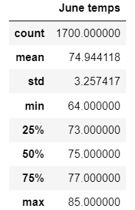
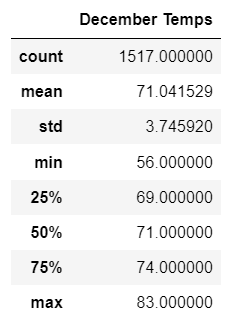

# Surfs_up Analysis
 Thinking about investing in Hawai in a new Surf n' Shake shop serving surfboards and ice creams to locals, and tourists. W. Avy, a surfing lover is interested about look into weather data to know the probability of success.

## Overview of Project 
### Purpose 
The purpose of this project is to do a climate analysis on December and June, vacation seasons, and know the temperature during these months to decide if it is a good choice to invest in the surf shop according to the weather. Knowing the minimum and the maximum temperatures will help to decide if will be enough sales. 

## Results 

We can see that in June the minimum temperature is 64°F and the maximum is 85°F, according to this information the is a good temperature to eat ice cream, also we can see that the mean is 74°F, a warm temperature enough to get clients.

In another hand, during December we can visualize a minimum temperature of 56°F and a maximum temperature of 83°F,  with a mean of 71°F, It's a little bit colder than June but it still being warm so is a good opportunity to get clients too.

Finally, we can realize that in these months the temperature doesn't change a lot so, if we observe also the percentiles both have a similar temperature, this will help to be prepared.

### Summary
In the end, we can conclude that the weather will be a good resource to get clients because the surf and ice cream shop works better with the sun and high or warm temperatures.
If we want to analyze these to months and have more information to know if it will be better for the shop, we can use two ore queries to know the following:

          June_prep = []
          June_prep  = session.query(Measurement.date, Measurement.prcp)
          June_prep  = session.query(Measurement.date, Measurement.prcp).filter(exctract('month',Measurement.date == 12).all()
          
We can use this query to know the probability of precipitation in both months because sometimes a warm temperature doesn't mean a sunny day. So it's important to analyze this column too.
